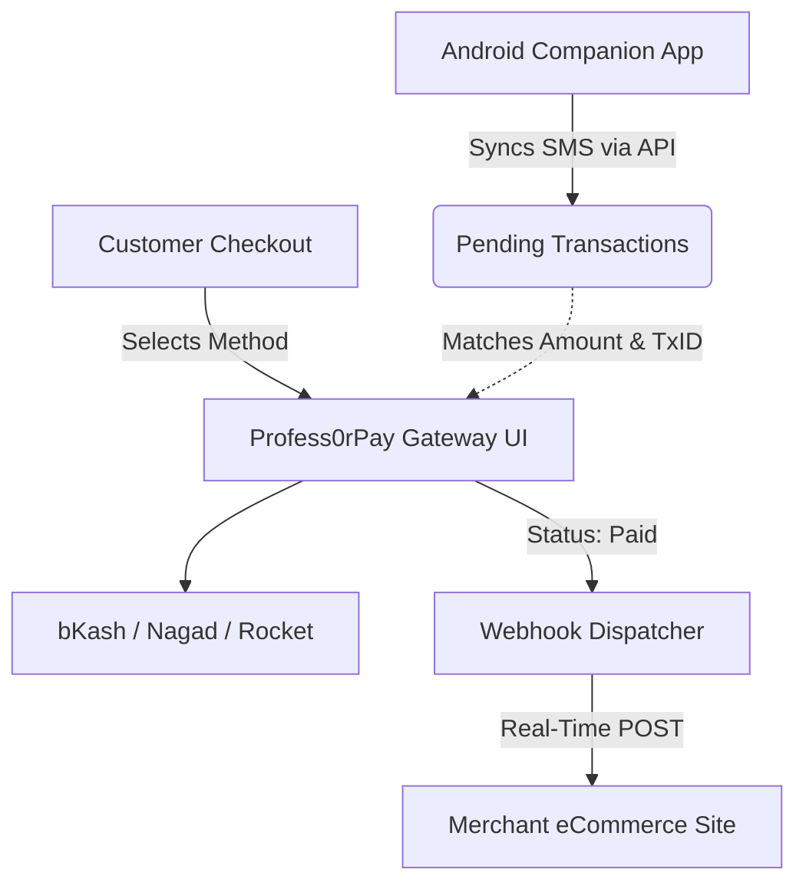

<p align="center">
  
</p>
<p align="center">
  <strong>The Ultimate Open-Source Self-Hosted Payment Automation Platform</strong><br>
  Unify payment gateways, wallets, and SMS-based verification into one seamless, white-labeled system you fully control.
</p>

<p align="center">
  <a href="#-installation--deployment">
    
  </a>
  <a href="LICENSE">
    
  </a>
</p>

---

## 🌍 The Profess0rPay Vision

Traditional payment gateways lock you into their ecosystem, charge high transaction fees, and hold your funds. 

**Profess0rPay is a self-hosted orchestration engine designed for absolute freedom.**
It allows individuals and small businesses to launch their own customized payment gateway within 2 minutes. By leveraging SMS verification, API connections, and modular gateways, you can process payments directly to your personal accounts without any middlemen.

### Why Choose Profess0rPay?
* **Zero Platform Fees:** Payments flow directly to your personal Mobile Financial Service (MFS) accounts. No intermediary taking a percentage.
* **White-Label Branding:** Full control to change your brand name, logo, favicon, and primary colors directly from the Admin Panel.
* **Instant Deployment:** Forget complex setups. Upload the files, hit `/install`, and the graphical wizard handles database connections and admin setup instantly.
* **Open & Extensible:** Built on core PHP. It’s highly modular and supports continuous expansion based on community feedback.

---

## ✨ Core Features & Capabilities

### 📱 Official Android Companion App
Manage your transactions, notifications, and gateways directly from your smartphone! Our companion app seamlessly syncs background SMS notifications to auto-verify your MFS transactions in real-time.
**Download the official App:** [From Google Play Store](https://play.google.com/store/apps/details?id=com.qubeplug.billpax_tools)

### 💳 Supported Payment Methods
- **Local MFS Gateways:** Connect bKash, Nagad, Rocket, and other Mobile Financial Services via SMS verification or direct API tokenization.
- **Manual Gateways:** Upload custom QR codes for users to scan and pay manually.

### 🛠️ Platform Capabilities
- **2-Minute Installer**: Easy graphical setup wizard right out of the box.
- **Payment Link Generation**: Easily create and share beautiful payment links with customers without writing any code.
- **Developer-Ready REST API**: Connect your external eCommerce websites, apps, and billing systems effortlessly using our Secure API Keys and Scopes.
- **Webhook Integration (IPN)**: Real-time server-to-server callbacks ensure your website instantly knows when a customer completes a payment.
- **One-Click System Updates**: Seamlessly upgrade your Profess0rPay core with the built-in Force Re-install and Updater module.

---

## 🏗️ System Architecture

Profess0rPay operates efficiently using core PHP and a robust MySQL database.



---

## 📁 Directory Structure Breakdown

Understanding the core folders will help you confidently modify or extend the engine:

```text
Profess0rPay/
├── assets/                     # CSS, JS, and Image assets for the UI
├── docs/                       # Official Documentation (e.g., API_DOCUMENTATION.md)
├── install/                    # The 2-Minute Web Setup Wizard
├── plugins/                    # Integrations & 3rd-Party Plugins (e.g., WooCommerce)
├── pp-content/                 # Core System Content & Logic
│   ├── pp-admin/               # Administrative Dashboard UI & Logic
│   ├── pp-include/             # Core System Functions, Adapters, and Routing Logic
│   └── pp-modules/             # Extensible Plugin System
│       ├── pp-addons/          # System Addons
│       ├── pp-gateways/        # Payment Gateway Drivers (bKash, Nagad, PayPal, etc.)
│       └── pp-themes/          # Checkout UI Themes
├── pp-media/                   # Uploaded media, SDKs, and dynamic storage
└── index.php                   # The primary application router
```

---

## 🚀 Installation & Deployment

Installing Profess0rPay is incredibly simple.

### Server Requirements
* **PHP:** Version 8.1 or higher
* **Database:** MySQL 5.7+ or MariaDB 10.3+
* **PHP Extensions:** `PDO`, `pdo_mysql`, `cURL`, `mbstring`, `OpenSSL`, `JSON`

### Setup Guide (cPanel / VPS)
1. **Download:** Grab the latest release from the repository.
2. **Upload:** Upload and extract the files to your server's public directory (e.g., `public_html` on cPanel).
3. **Database Setup:** Create a new, empty MySQL database and a corresponding user with full privileges.
4. **Run the Installer:** Visit your domain in a web browser (e.g., `https://yourdomain.com/`). The automatic 2-Minute Installer will greet you.
5. **Configuration:** 
   - Enter your newly created Database Name, Username, and Password.
   - Set up your primary Admin Account credentials.
6. **Finish:** Once completed, the system will automatically configure your environment and log you in!

---

## 📧 Email & SMTP Configuration (Admin Guide)

To ensure your system can send transaction receipts and notifications successfully without landing in spam, configure the SMTP settings from your Admin Panel under **Brand Settings -> SMTP Settings**.

### Option 1: Gmail SMTP Setup (Easiest)
You must generate a 16-character **App Password** from your Google Account (do not use your regular password).
1. Go to your Google Account -> **Security**.
2. Enable **2-Step Verification**.
3. Search for **App Passwords** and generate a new password for 'Profess0rPay'.

**Admin Panel Settings:**
- **SMTP Host:** `smtp.gmail.com`
- **SMTP Port:** `465` (or `587`)
- **Encryption:** `ssl` (or `tls`)
- **SMTP Username:** Your regular Gmail address (e.g., `example@gmail.com`)
- **SMTP Password:** The 16-character App Password.

### Option 2: cPanel / Webmail SMTP Setup (Professional)
To use a custom domain email (e.g., `support@yourdomain.com`), you must configure proper DNS records to avoid spam filters.

**Prerequisites (Important):**
1. Ensure your domain's **SPF**, **DKIM**, and **DMARC** TXT records are added to your DNS manager (e.g., Cloudflare/Namecheap). You can find these in cPanel under **Email Deliverability**.
2. In cPanel, navigate to **Email Routing**, select your domain, and set it to **Local Mail Exchanger**.

**Admin Panel Settings:**
- **SMTP Host:** `localhost` (if hosted on the same server) or `mail.yourdomain.com`
- **SMTP Port:** `465`
- **Encryption:** `ssl`
- **SMTP Username:** Your custom email address (e.g., `support@yourdomain.com`)
- **SMTP Password:** The password for this email account.
*(Note: Ensure the "Support Email" in your Brand Settings matches this SMTP Username perfectly to prevent spoofing flags).*

---

## 📚 API Documentation

Want to integrate Profess0rPay into your website? Read our comprehensive developer guide!
👉 [Read the API Documentation](docs/API_DOCUMENTATION.md)

---

## 🙏 Credits & Acknowledgements

This project was built to expand upon open-source payment automation capabilities. 
**Special thanks and credit** goes to the original developers of [PipraPay](https://github.com/PipraPay/PipraPay). Profess0rPay is a community-driven fork and continuation of the PipraPay ecosystem, aimed at adding stability, robust security patches, dynamic timezone handling, and extended administrative controls.

---

## 📅 Release Strategy

- **v1.3.2** — Patch (Current): SMTP Integration, Core Bug Fixes, Invalid Token Fixes, DNS & Delivery Improvements.
- **v1.3.0** — Feature & UX Update: Major Stability, UI/UX Improvements, Smart Redirects, Rebranded 3rd Party Plugins, Dynamic API URLs.
- **v1.2.3** — Patch: SMS Device Fixes, Dynamic Timezones, Webhook Buttons, and Update Confirmations.
- **v1.0.0** — Stable: Installer, White-label Branding, Admin Panel, Payment Links, REST API.
- **v1.3** — Planned: WooCommerce Plugin / PHP SDK.
- **v1.4** — Planned: Docker Support & GitHub Actions (CI).
- **v2.0** — Planned: Merchant System, New Gateways, Better UI.

## 🤝 Contributing
We welcome contributions! Please see our [CONTRIBUTING.md](CONTRIBUTING.md) for details on how to submit pull requests, report issues, and suggest features.

## 🔒 Security
If you discover a security vulnerability, please review our [SECURITY.md](SECURITY.md) guidelines for responsible disclosure.

## 📄 License
This project is licensed under the **GNU Affero General Public License v3.0 (AGPL-3.0)**. See the [LICENSE](LICENSE) file for more details.
